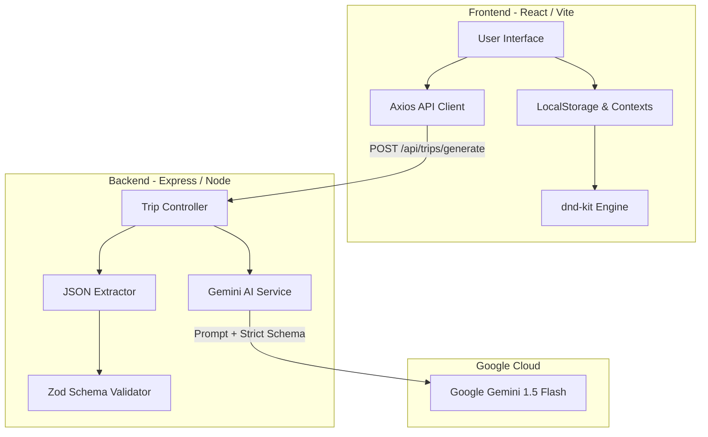
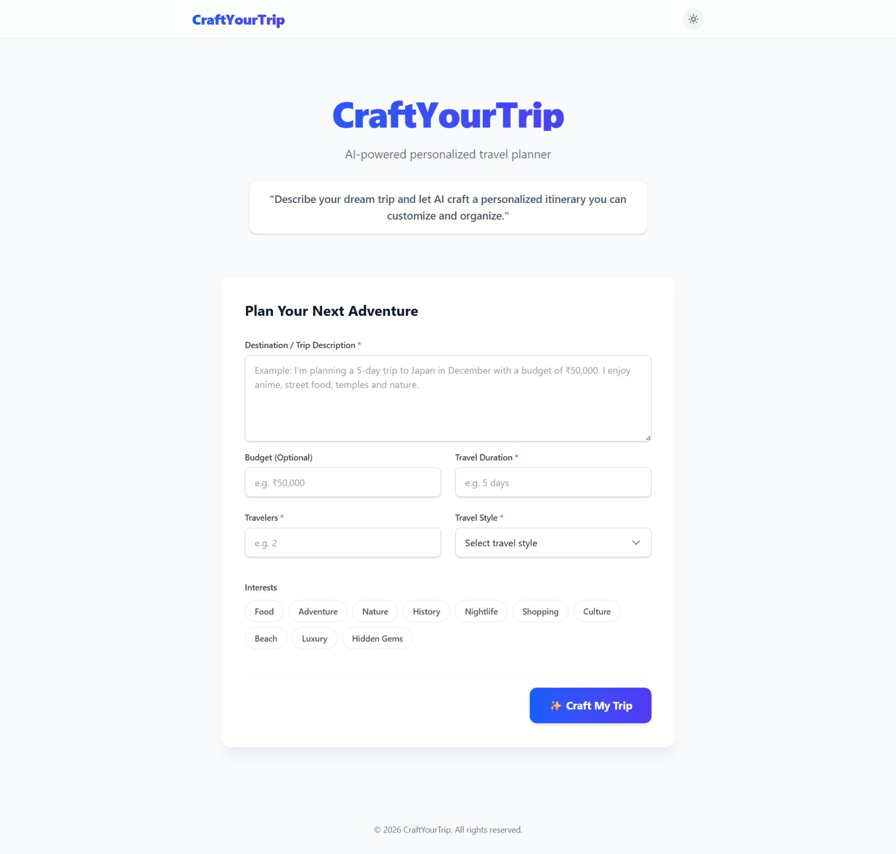
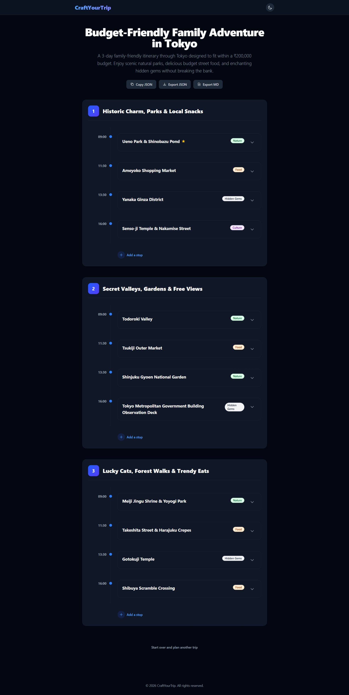
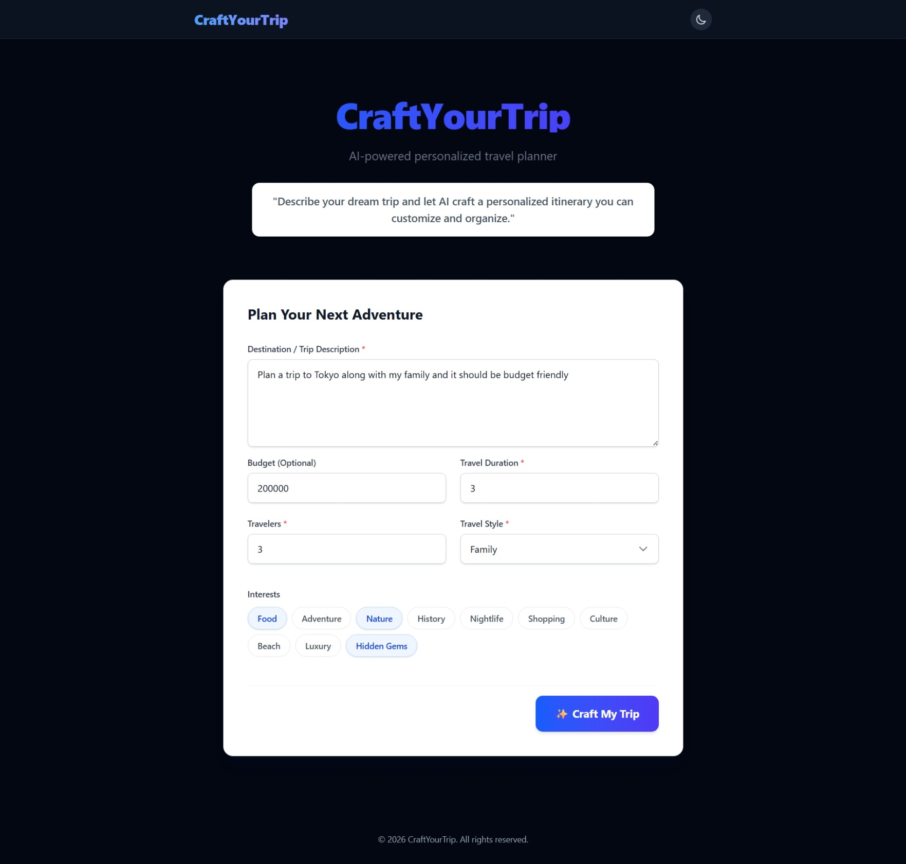

# 🧳 CraftYourTrip

> AI-powered personalized travel planner.

CraftYourTrip is a production-ready web application that leverages Google's Gemini AI to instantly generate structured, interactive, day-by-day travel itineraries from natural language descriptions.

---

## ✨ Features
- **AI-Powered Generation**: Transform unstructured ideas (e.g., *"5 days in Kyoto for a couple who loves matcha and temples with a budget of ₹50,000"*) into organized, structured travel plans.
- **Interactive Drag & Drop**: Powered by `@dnd-kit`. Easily reorder stops within a single day or drag activities across different days with smooth, physics-based animations.
- **Trip Customization**: Edit stop details (name, time, duration, description) or mark specific stops as Favorites (⭐).
- **Persistent State**: Automatically saves your active itinerary, favorites, and dark mode preference to `localStorage`.
- **Premium Dark Mode**: Carefully tailored, high-contrast dark theme with a toggle in the navigation bar.
- **Export Capabilities**: Instantly copy your itinerary as JSON, or download it as a standalone `.json` or `.md` (Markdown) file.
- **Delightful UX**: Features pulse skeleton loaders, smooth toast notifications, and keyboard shortcuts (`Ctrl+Enter` to generate, `Esc` to close modals).

---

## 🛠️ Tech Stack

### Frontend
- **Framework**: React 19 + Vite
- **Styling**: Tailwind CSS v4
- **State Management**: React Hooks (`useState`, `useContext`, custom `useLocalStorage`)
- **Drag & Drop**: `@dnd-kit/core` & `@dnd-kit/sortable`
- **HTTP Client**: Axios

### Backend
- **Runtime**: Node.js + Express.js
- **AI SDK**: Google Gen AI SDK (`@google/generative-ai`)
- **Validation**: Zod
- **Utilities**: Custom JSON extraction and timeout wrappers

---

## 🏗️ Architecture



---

## 📁 Folder Structure

```
CraftYourTrip/
├── frontend/
│   ├── src/
│   │   ├── components/    # Reusable UI components (DayCard, StopCard, Skeletons, etc.)
│   │   ├── contexts/      # Theme and Toast Context Providers
│   │   ├── hooks/         # Custom hooks (useDragAndDrop, useLocalStorage, useTheme, useToast)
│   │   ├── layouts/       # Main layout wrappers (Navigation Bar)
│   │   ├── pages/         # Page views (Home)
│   │   ├── services/      # Axios API communication layer
│   │   └── utils/         # Helper functions (Category badge coloring)
│   ├── package.json
│   └── tailwind.config.js
└── backend/
    ├── controllers/       # Route logic and HTTP response handlers
    ├── routes/            # Express API route definitions
    ├── services/          # Google Gemini AI communication layer
    ├── utils/             # Safe JSON parser and markdown block strippers
    ├── validators/        # Zod schema definitions for strict output matching
    ├── server.js          # Express server entry point
    └── package.json
```

---

## 🚀 Installation

### Prerequisites
- Node.js (v18 or higher)
- A [Google Gemini API Key](https://aistudio.google.com/app/apikey)

### Clone the Repository
```bash
git clone https://github.com/yourusername/craftyourtrip.git
cd craftyourtrip
```

---

## 🔐 Environment Variables

Create a `.env` file inside the `backend/` directory:
```env
PORT=5000
GEMINI_API_KEY=your_gemini_api_key_here
```

Create a `.env` file inside the `frontend/` directory:
```env
VITE_API_URL=http://localhost:5000/api
```

---

## 💻 Running Frontend

In a terminal window, navigate to the frontend directory and start the Vite development server:
```bash
cd frontend
npm install
npm run dev
```
The web application will be accessible at `http://localhost:5173`.

---

## ⚙️ Running Backend

In a separate terminal window, navigate to the backend directory and start the Express server:
```bash
cd backend
npm install
npm run dev
```
The API server will run on `http://localhost:5000`.

---

## 🌍 Deployment

### Frontend (Vercel)
1. Import the repository into Vercel and set the Root Directory to `frontend`.
2. Vercel will auto-detect Vite (`npm run build` -> `dist`).
3. Add the Environment Variable `VITE_API_URL` pointing to your deployed backend URL + `/api`.
4. Deploy!

### Backend (Render)
1. Create a New Web Service on Render and set the Root Directory to `backend`.
2. Set Build Command to `npm install` and Start Command to `node server.js`.
3. Add the `GEMINI_API_KEY` Environment Variable.
4. Deploy!

---

## 🤖 How AI is used

CraftYourTrip uses the `gemini-flash-latest` model from Google Gen AI. When a user submits a trip request, the backend constructs a rich system prompt instructing the model to act as an expert travel planner. It injects user constraints (budget in Indian Rupees ₹, travel style, duration, and interests) and demands that the output adheres strictly to a predefined JSON schema without any surrounding markdown commentary.

---

## 🛡️ Handling unreliable AI output

Large Language Models (LLMs) can occasionally hallucinate, wrap outputs in markdown code blocks, or return malformed syntax. To guarantee that the application never crashes due to bad AI responses, we employ a multi-layered defense:
1. **Body Limit Protection**: Express body parser limits are raised to `2MB` to prevent crash-loops on massive context submissions.
2. **Safe JSON Extraction**: A custom `extractJSON` utility scans the AI response, stripping away markdown backticks (` ```json ... ``` `) and locating the valid JSON substring.
3. **Zod Schema Validation**: Before sending data back to the client, the parsed object is checked against a strict Zod schema (`itinerarySchema`). If the AI omits required fields (like `time`, `duration`, or `category`), the backend rejects the payload and returns a clean error.
4. **Timeout Wrappers**: Both frontend and backend implement strict 60-second timeouts. If the AI hangs or rate-limits occur, the user receives a graceful retry prompt instead of an infinite loading spinner.

---

## ⚠️ Known limitations
- **Real-Time Availability**: The AI generates recommendations based on its training data; it does not check real-time ticket availability, seasonal closures, or live hotel pricing.
- **Geographic Precision**: Stops are organized chronologically, but travel time between locations is estimated by the AI and not calculated via live GPS routing engines.

---

## 🔮 Future improvements
- **Interactive Google Maps**: Visually pin generated stops on an embedded map with polyline routing between activities.
- **Cover Photo Injection**: Integrate the Unsplash API to dynamically fetch high-resolution imagery for each destination and stop.
- **Collaborative Planning**: WebSockets integration allowing multiple friends or family members to drag-and-drop and edit the itinerary simultaneously.
- **User Authentication**: Firebase or Supabase auth to store historical itineraries in the cloud.

---

## ⏱️ Time spent
- **Frontend Architecture & UI UX**: ~12 hours
- **Backend API & Gemini Integration**: ~8 hours
- **Drag-and-Drop & Persistence Engine**: ~6 hours
- **QA, Performance Polish & Refactoring**: ~4 hours
- **Total Estimated Development Time**: ~30 hours

---

## 📸 Screenshots

| Hero & Form | Interactive Planner | Dark Mode |
| :---: | :---: | :---: |
|  |  |  |
