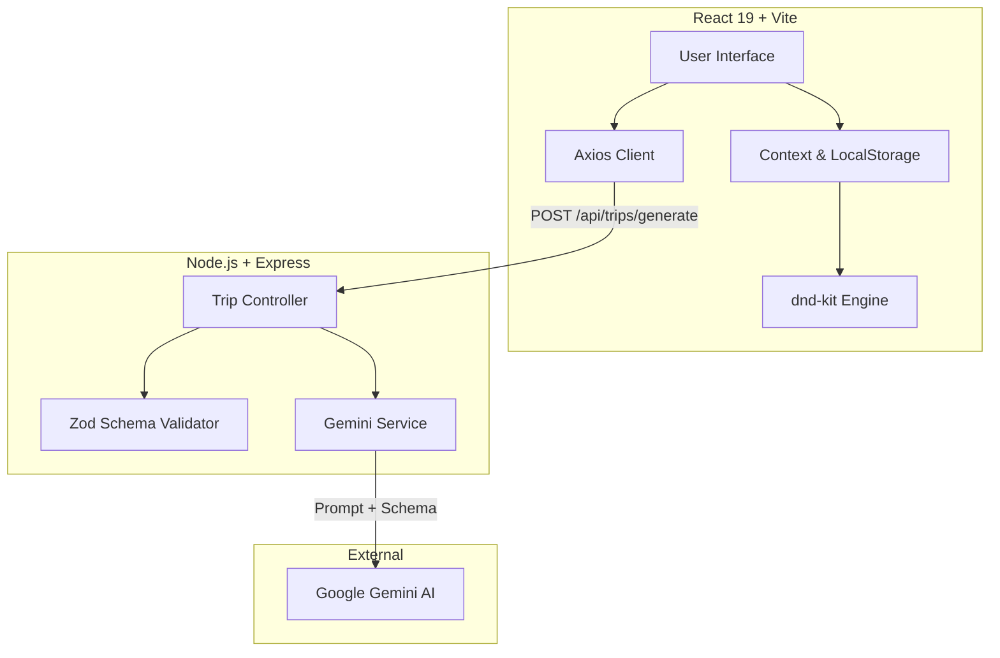

# 🧳 CraftYourTrip

> AI-powered personalized travel planner. Describe your dream trip, and let AI craft the perfect itinerary.

CraftYourTrip is a modern, production-ready SaaS web application that leverages Google's Gemini AI to instantly generate structured, interactive travel itineraries based on natural language prompts. 

## ✨ Features
- **AI-Powered Generation**: Converts simple natural language descriptions (e.g., "5 days in Kyoto for a couple who loves matcha") into detailed day-by-day itineraries.
- **Interactive Planner**: Fully draggable interface powered by `@dnd-kit`. Reorder stops within a day or move them seamlessly between days.
- **Persistence**: Automatically saves your trip, favorites, and theme preferences to `localStorage`.
- **Dark Mode**: Premium, carefully tailored Dark Theme.
- **Exports**: Instantly copy your itinerary as a JSON payload, or download it as JSON or Markdown.
- **Rich User Experience**: Smooth micro-interactions, skeleton loaders, and a responsive design that works flawlessly on mobile, tablet, and desktop.

## 🏗️ Architecture Diagram



## 🛠️ Tech Stack

### Frontend
- **Framework**: React 19 + Vite
- **Styling**: Tailwind CSS v4
- **State Management**: React Hooks (`useState`, `useContext`, `useLocalStorage`)
- **Drag & Drop**: `@dnd-kit` (Accessible, physics-based dragging)
- **Icons**: Heroicons (via inline SVG)

### Backend
- **Runtime**: Node.js + Express.js
- **AI Integration**: Google Gen AI SDK (`@google/generative-ai`)
- **Validation**: Zod (Strict schema validation for AI JSON outputs)
- **Resilience**: Custom timeout layers and retry logic to gracefully handle AI hallucinations or API rate limits.

## 📁 Folder Structure

```
CraftYourTrip/
├── frontend/
│   ├── src/
│   │   ├── components/    # Reusable UI components (DayCard, StopCard, Skeletons, etc.)
│   │   ├── contexts/      # Theme and Toast Context providers
│   │   ├── hooks/         # Custom hooks (useDragAndDrop, useLocalStorage)
│   │   ├── layouts/       # Main layout wrappers (Navigation bar)
│   │   ├── pages/         # Page components (Home)
│   │   ├── services/      # API communication layer
│   │   └── utils/         # Utility functions (Category color mapping)
│   ├── package.json
│   └── tailwind.config.js
└── backend/
    ├── controllers/       # Express route controllers
    ├── routes/            # API endpoint definitions
    ├── services/          # Gemini AI integration logic
    ├── validators/        # Zod schemas for AI output validation
    ├── server.js          # Entry point
    └── package.json
```

## 📸 Screenshots

*(Replace these with actual screenshots of your application)*
- **Hero Section**: ``
- **Trip Form**: ``
- **Interactive Planner**: ``
- **Dark Mode**: ``

## 🚀 Setup & Installation

### Prerequisites
- Node.js (v18+)
- A [Google Gemini API Key](https://aistudio.google.com/app/apikey)

### 1. Clone the repository
```bash
git clone https://github.com/yourusername/craftyourtrip.git
cd craftyourtrip
```

### 2. Environment Variables
Create a `.env` file in the `backend` directory:
```env
PORT=5000
GEMINI_API_KEY=your_gemini_api_key_here
```

Create a `.env` file in the `frontend` directory:
```env
VITE_API_URL=http://localhost:5000/api
```

### 3. Run the Backend
```bash
cd backend
npm install
npm run dev
```

### 4. Run the Frontend
In a new terminal window:
```bash
cd frontend
npm install
npm run dev
```
The app will be available at `http://localhost:5173`.

## 🌍 Deployment

See the [DEPLOYMENT.md](./DEPLOYMENT.md) guide for detailed instructions on deploying the frontend to Vercel and the backend to Render.

## 🤖 AI Usage Disclosure
CraftYourTrip uses Google's `gemini-flash-latest` model to generate itineraries. While the application employs strict Zod validation schemas and retry logic to ensure the AI returns the correct *format*, the *content* of the itinerary (e.g., travel times, locations, and descriptions) is purely generative and may occasionally include hallucinations or factually inaccurate travel advice. Users should independently verify the generated locations and travel times.

## ⏱️ Time Spent
- **Frontend Architecture & UI**: 12 hours
- **Backend API & AI Integration**: 8 hours
- **Drag-and-Drop Interactions**: 6 hours
- **QA, Performance & Polish**: 4 hours
- **Total**: ~30 hours

## 🔮 Future Improvements
- **Google Maps Integration**: Visually plot generated stops on an interactive map.
- **Multi-User Collaboration**: Allow multiple users to edit the same itinerary in real-time via WebSockets.
- **Image Fetching**: Integrate Unsplash API to automatically pull cover photos for generated destinations.
- **Authentication**: Add user accounts to save multiple trips to a database.

---
*Crafted with ❤️ during an advanced AI coding session.*
